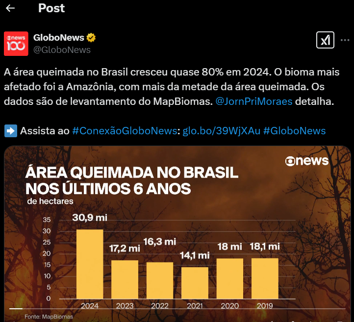

# Task 1: Reflection

The readings on visualizing uncertainty reminded me of a recent chart from GloboNews (see below) about burned areas in Brazil, especially in the Amazon Forest. While the chart is visually appealing and well-structured, it presents two key issues. First, the x-axis is in descending order (2024 to 2019), making it harder to immediately recognize the significant increase in burned areas in 2024. This aligns with previous discussions on misleading data visualizations highlighting that design choices can distort perception.
Second, even with a well-constructed chart, uncertainty remains. The articles emphasizes how people struggle to interpret uncertainty in data, especially when predicting future trends. While this visualization provides historical context, it does not account for factors influencing future fires, such as climate change policies or illegal deforestation. This reinforces the challenge of effectively communicating uncertainty and the need for transparency in data storytelling.

```{r, echo=FALSE, fig.align="center", out.width="50%", out.height="300px"}

```
Source: https://x.com/GloboNews/status/1882059986169200647


# Task 2: Visualizing uncertainty with gapminder

For this exercise you'll revisit Hans Rosling's gapminder data on health and wealth. Install the **gapminder** package if you haven't already. Also install the **ggridges** and **gghalves** packages.

```{r load-libraries-data, warning=FALSE, message=FALSE}
library(tidyverse)  # For ggplot, dplyr, and friends
library(gapminder)  # For health/wealth data
library(ggridges)   # For ridge plots
library(gghalves)   # For half geoms
```

# See dataframe gapminder
```{r}
gapminder
```


## Histograms

Make a histogram of *logged* GDP per capita for 1997 only, across all five continents. 

# Filter dataset to have only 1997 data
```{r filter-gapminder-1997}
gapminder_1997 <- gapminder %>%
  filter(year == 1997)
```


# Create histogram with log-scaled x-axis, fill by continent, and facet by continent
```{r plot-histogram}
ggplot(gapminder_1997, aes(x = gdpPercap, fill = continent)) +
  geom_histogram(bins = 30, alpha = 0.7) +
  scale_x_log10() +  # Log transform x-axis
  facet_wrap(~continent) +  # Facet by continent
  labs(title = "Distribution of GDP per Capita (Logged) in 1997",
       x = "GDP per Capita (log scale 10)",
       y = "Number of Countries") +
  theme_minimal()
```


## Densities

Make a ridge plot of life expectancy over time, from 1952 to 2007. You'll need to use the full gapminder data, not the 1997-only data.

# Create the ridge plot
```{r plot-ridgeplot}
ggplot(gapminder, aes(x = lifeExp, y = as.factor(year), fill = as.factor(year))) +
  geom_density_ridges(alpha = 0.7, scale = 1.2) +
  labs(title = "Global Life Expectancy (1952 - 2007)",
       x = "Life Expectancy",
       y = "Year") +
  theme_minimal() +
  theme(legend.position = "none")
```

## Boxes, violins, and others

Make a filtered dataset that selects data from only 2007 *and* removes Oceania. Show the distribution of *logged* GDP per capita across the *four* continents using some combination of boxplots and/or violin plots and/or strip plots, either overlaid on top of each other, or using their `geom_half_*()` counterparts from **gghalves**.

# Create a filtered dataset
```{r filter-gapminder-2007-sans-oceania}
gapminder_2007_sans_oceania <- gapminder %>%
  filter(year == 2007 & continent != "Oceania")
```

```{r plot-distribution}
ggplot(gapminder_2007_sans_oceania, aes(x = continent, y = gdpPercap, fill = continent)) +
  geom_half_violin(side = "l", alpha = 0.6) +  # Half violin on the left
  geom_half_point(side = "l", position = position_jitter(width = 0.1), alpha = 0.5) +
  geom_half_boxplot(side = "r", width = 0.6, alpha = 0.2, outlier.shape = NA) +
  scale_y_log10() +  # Log-transform GDP per capita
  labs(title = "GDP per Capita (Logged) in 2007 Across Continents",
       x = "Number of Countries by Continent",
       y = "GDP per Capita (log scale)") +
  theme_minimal() +
  theme(legend.position = "none")
```
